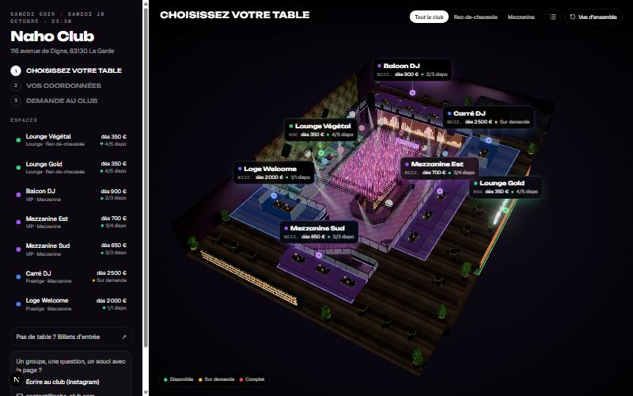
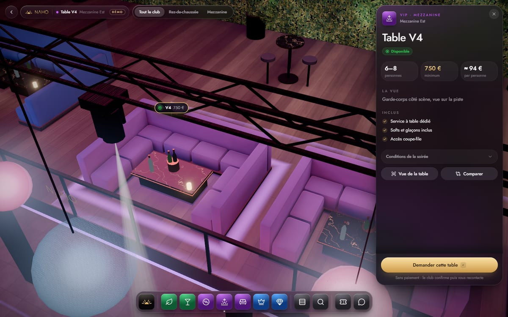
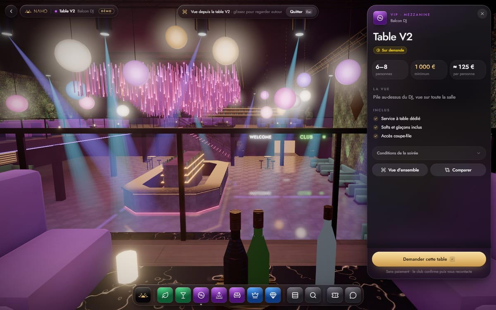
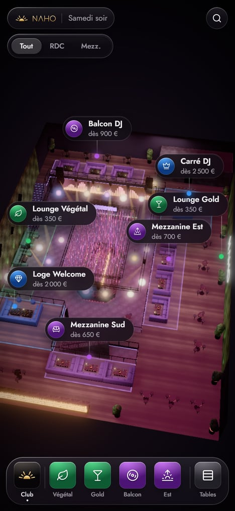

# VYRA-dice

**Faites voir l'expérience avant de vendre la table.** Mini-app mobile qui présente un club en 3D — espaces,
tables, vues, capacité, prix/minimum, prestations — et transmet la demande du client à l'équipe du club, qui
confirme et encaisse dans ses propres outils.

Pilote gratuit, mesuré (H1 compréhension · H2 conversion · H3 valeur · H4 opérations · H5 adoption).


## Démo : Naho Club

POC de prospection (VYR-55) : `/naho/samedi`. Plan reconstitué depuis un croquis ; tables, capacités et prix
**provisoires, non validés par le club**. Le formulaire fonctionne en **mode démo** : aucune demande n'est transmise.

| Vue d'ensemble                           | Table V4                              | Vue depuis la table                  | Mobile                                  |
| ---------------------------------------- | ------------------------------------- | ------------------------------------ | --------------------------------------- |
|  |  |  |  |

## Démarrer

```bash
pnpm install
cp .env.example .env.local
pnpm dev                     # http://localhost:3000/naho/samedi
```

Tester sur son téléphone (même Wi-Fi que le PC) :

```bash
pnpm dev --hostname 0.0.0.0  # puis ouvrir http://<IP-du-PC>:3000/naho/samedi sur le téléphone
```

Les performances se jugent en production (`pnpm build && pnpm start`) : le mode dev compile three.js à la volée.

## Stack

Next.js 16 · TypeScript · Tailwind v4 · shadcn/ui · three.js / React Three Fiber / drei / postprocessing ·
Blender (scripts Python) → glTF + lightmaps Cycles · PostHog · (Supabase + Resend au jalon G1) · Vercel.

## Documentation

| Doc                                          | Contenu                                                 |
| -------------------------------------------- | ------------------------------------------------------- |
| [docs/linear.md](docs/linear.md)             | Cadrage, jalons G0–G6, responsabilités, workflow Linear |
| [docs/github.md](docs/github.md)             | Branches, commits atomiques, PR, CI                     |
| [docs/architecture.md](docs/architecture.md) | Architecture, modèle de données, flux d'une demande     |
| [docs/3d-pipeline.md](docs/3d-pipeline.md)   | Production d'un club en 3D (layout → Blender → web)     |
| [docs/analytics.md](docs/analytics.md)       | Événements et lecture H1–H5                             |

## Équipe

- **Pierre** — dev, data/analytics
- **Jonathan** — vente, audit
- Ensemble — produit/design, implémentation/adoption, opérations/support
